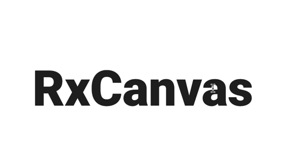

<p align="center">
  
</p>

**Move** **Resize** **Warp** **Scale** **Rotate** any element in inside a page.

## Demo 
   [Stackbliz](https://stackblitz.com/edit/typescript-4hbnwf)
   [Stackbliz React](https://stackblitz.com/edit/rxcomponent)


## Get Started

### With npm

```sh
 npm install rxjs
 npm install @azure06/rxcomponent
```

## Usage

```ts
import { RxComponent, RxHandler } from '@azure06/rxcomponent';
import { tap } from "rxjs/operators";

const appDiv: HTMLElement = document.getElementById("app");

const rxComponent = new RxComponent(appDiv, {
  width: "200px",
  height: "80px"
});

const rxHandler = new RxHandler(rxComponent, {
  draggable: true,
  rotable: true,
  resizable: true,
  interactive: true
});

rxHandler
  .onDrag(tap(_ => console.log("Dragging!🔥")))
  .onResize(tap(_ => console.log("Resizing")))
  .onRotation(tap(_ => console.log("Rotating")));

```

**RxComponent** is [MIT licensed](LICENSE).

## Codebase

**RxComponent** is written completely in TypeScript, and built using **rollup**.

**RxComponent** makes extensive use of functional and reactive programming.
